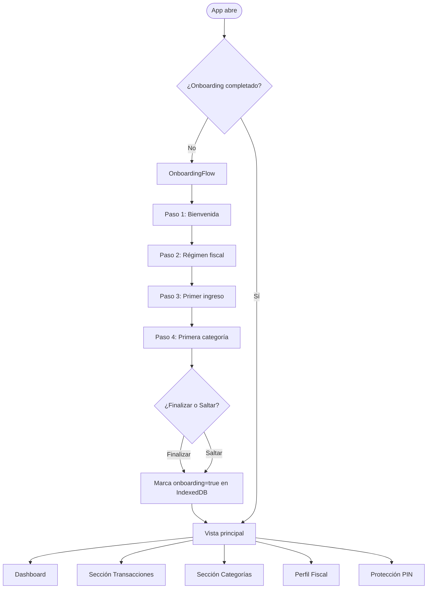

# Flujo de la aplicación — Caudal

Esta guía describe el **flujo completo** de pantallas, estados y decisiones que atraviesa un usuario desde que abre Caudal por primera vez hasta que usa la app en su estado normal.

---

## Diagrama general



---

## 1. Arranque de la app (`main.jsx` → `App.jsx`)

Al iniciar, `App.jsx` ejecuta en paralelo tres cargas asíncronas desde IndexedDB:

| Dato | Hook | Fuente |
|---|---|---|
| Lista de ingresos | `useAsyncList(listIncomes)` | `db.incomes` |
| Lista de egresos | `useAsyncList(listExpenses)` | `db.expenses` |
| Lista de categorías | `useAsyncList(listCategories)` | `db.categories` |
| Estado onboarding | `useAsyncValue(getOnboardingCompleted)` | `db.settings['onboardingCompleted']` |

Mientras cargan, se muestra una pantalla de carga mínima. Si alguna carga falla, se muestra `ErrorState`.

---

## 2. Flujo de Onboarding (primera vez)

Si `onboardingCompleted` es `false` (o no existe), el usuario entra al `OnboardingFlow`, que consta de **4 pasos lineales**:

### Paso 1 — Bienvenida (`welcome`)
- Pantalla informativa sin inputs.
- El usuario puede pulsar **Continuar** o **Saltar** (salta todo el onboarding).

### Paso 2 — Régimen fiscal (`regimen`)
- El usuario activa uno o ambos checkboxes: **Asalariado** y/o **RESICO**.
- Introduce el ingreso mensual de cada régimen activo.
- Al continuar, se llama `saveFiscalProfile(profile)` → persiste en `db.settings['fiscalProfile']`.

### Paso 3 — Primer ingreso (`income`)
- Formulario con: monto, fecha, descripción, categoría, tipo (único/recurrente) y régimen.
- Al continuar, se llama `addIncome(data)` → persiste en `db.incomes`.

### Paso 4 — Primera categoría (`category`)
- El usuario crea una categoría personalizada: nombre, tipo (ingreso/egreso), color, ícono.
- Al finalizar, se llama `createCategory(category)` → persiste en `db.categories`.
- Luego se recargan todos los datos y se marca `onboardingCompleted = true`.

> **Saltar en cualquier paso** marca `onboardingCompleted = true` inmediatamente, sin guardar los datos del paso actual.

---

## 3. Vista principal

Una vez completado el onboarding (o saltado), el usuario ve la **vista principal**, que es una página única de scroll vertical con las siguientes secciones en orden:

```
┌──────────────────────────────────┐
│  Header: "Caudal"                │
├──────────────────────────────────┤
│  Dashboard (si hay movimientos)  │
│  — o —                           │
│  EmptyState (si no hay datos)    │
├──────────────────────────────────┤
│  Sección Transacciones           │
├──────────────────────────────────┤
│  Sección Categorías              │
├──────────────────────────────────┤
│  Perfil Fiscal                   │
├──────────────────────────────────┤
│  Protección PIN                  │
└──────────────────────────────────┘
```

---

## 4. Flujo de datos (lectura → render → escritura)

```
IndexedDB (Dexie)
      │
      ▼
useAsyncList / useAsyncValue   ← hooks que abstraen carga + reload + error
      │
      ▼
App.jsx  ──────── pasa datos como props ──────►  features/*
      │
      ▼
Feature escribe via *Service.js  ──────────────►  IndexedDB (Dexie)
      │
      ▼
Feature llama onReload()  ─────────────────────►  re-fetch desde IndexedDB
```

No hay estado global (Redux/Zustand). Todo el estado se gestiona localmente en `App.jsx` y se propaga hacia abajo por props. Los features solo escriben y notifican.

---

## 5. Flujo del motor fiscal (Plan Pro)

```
FiscalProfileSection carga
      │
      ▼
isFeatureAvailable(Feature.TaxEngine)   ← featureGuard.ts consulta db.settings['subscriptionPlan']
      │
      ├── Plan.Free → Muestra bloqueo con CTA "Probar Pro"
      │
      └── Plan.Pro  → Muestra cálculos ISR en vivo
                          │
                          ▼
                calculateMixedTax(salariedIncome, resicoIncome)
                          │
                          ▼
                ┌─────────────────────┐
                │ calculateSalariedTax │  ← Tablas isr-asalariado.json + subsidio-empleo.json
                │ calculateResicoTax   │  ← Tablas isr-resico.json
                └─────────────────────┘
                          │
                          ▼
                Retención ISR Asalariado
                ISR Mensual RESICO
                Carga Fiscal Total
                Tasa Efectiva %
```

---

## 6. Flujo de PIN (protección local)

```
PinSection carga
      │
      ▼
hasPinStored()  ← consulta db.settings['pinHash']
      │
      ├── No tiene PIN → Muestra input + botón "Configurar PIN"
      │       │
      │       ▼
      │   setPin(pin)  → hashea con Web Crypto API → guarda en db.settings
      │
      └── Tiene PIN  → Muestra botón "Bloquear"
              │
              ▼ (usuario pulsa Bloquear)
          Estado local: locked = true
              │
              ▼ (usuario ingresa PIN)
          verifyPin(pin)  → compara hash → si ok: locked = false
```

> El PIN **nunca se transmite a ningún servidor**. Todo el hash y verificación ocurre en el dispositivo usando la Web Crypto API.

---

## 7. Manejo de errores

Cada feature maneja sus propios errores localmente con un estado `error` en el componente. Los errores se muestran con el componente `ErrorState`, que incluye un botón para cerrar el aviso y reintentar.

Los hooks `useAsyncList` y `useAsyncValue` exponen un campo `error` que `App.jsx` usa para mostrar un `ErrorState` global si la carga inicial falla.
